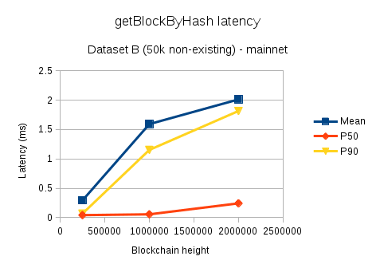
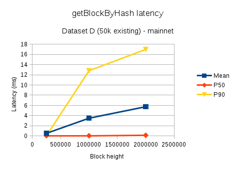
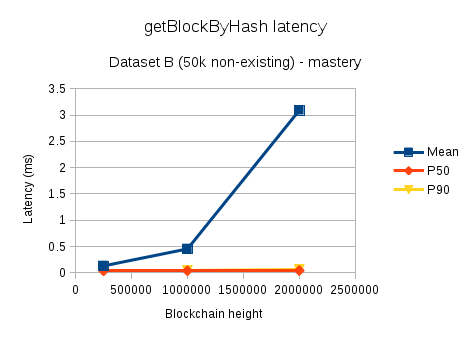
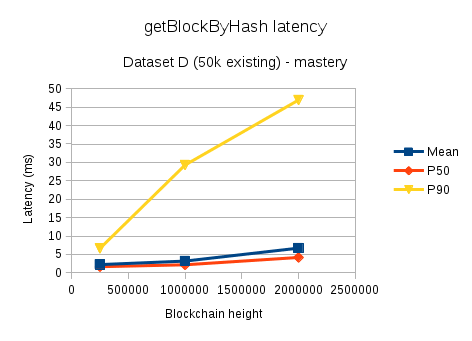
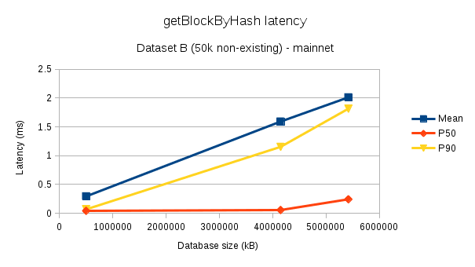
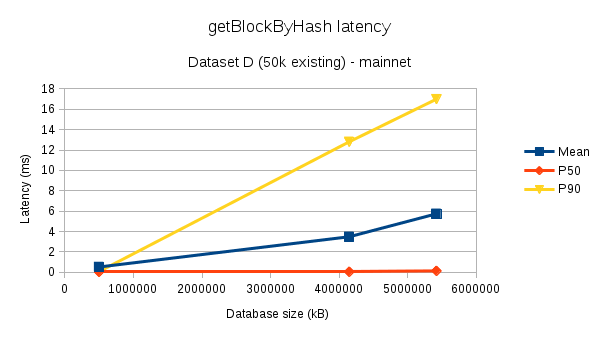

**Title**: Blockhash-based replay attack protection

**Author**: Kelvin Lam ([kelvin@aion.network](mailto:kelvin@aion.network))

**Type**: Core

**Status**: REVIEW

**Created**: 17 December 2018

**Contact**: Kelvin Lam ([kelvin@aion.network](mailto:kelvin@aion.network))

### Summary

A replay attack prevention mechanism that works by allowing transactions to
specify a (optional) block hash that must be present in the chain in order for
the transaction to be accepted.

### Value Proposition

The mechanism provides protection against replay attacks, making it less likely
that users' signed transactions on one Aion-compatible network or branch can be
maliciously broadcasted on a different Aion-compatible network or branch.  The
value for users is that it is safer to use these networks.

### Motivation

Motivation for this mechanism is driven mainly by two concerns:

1. Replay attacks if a hard fork were ever to create two competing chains
2. Replay attacks if anyone uses the same private key on two Aion-compatible
   networks.

Significance of the first concern is illustrated by Ethereum's post-DAO
hard-fork that resulted in the creation of Ethereum and Ethereum Classic.
Immediately after the fork, it was the case that any transaction in the
Ethereum branch of the fork was also a valid transaction on the Ethereum
Classic branch.  Since signed transactions are broadcast throughout the
network, any node on Ethereum network could capture the signed transactions and
then go on the Ethereum Classic network and broadcast that exact same
transaction.  The only thing that would prevent them from being executed was if
the transaction nonce for the account was incorrect.  The inverse case was also
true.  Both chains contained assets with significant value, making them
attractive targets.  As a result, Ethereum developers had to quickly implement
replay protection for Ethereum and the result was implementation of
[EIP-155](https://github.com/ethereum/EIPs/blob/master/EIPS/eip-155.md) in most
Ethereum clients.  EIP-155's design is tied to Ethereum's signature algorithm,
ECDSA, and not applicable with Aion, which uses EdDSA.

The second case is less dangerous, but still poses a threat to anyone who has
used their private key on more than one network.  While this is not a good
practice, it is possible that some users (particularly those inexperienced with
blockchain) may have done this; for example, to have an account on a testnet
with some test transactions that send Aions.  If this user uses the same
private key for an account on the mainnet, then a malicious actor could capture
the testnet transactions and broadcast them on mainnet to waste the victim's
funds.

### Non-Goals 

The following areas are out-of-scope of this proposal:

- 51% attack: different from replay attacks; this mechanism is not designed to
  deter this type of attack
- Not doing anything to try to "prevent" hard forks or competing chains

### Success Metrics

**Percentage of transactions using `beacon` field:** the new field will be
optional.  Omitting the field effectively means that this new replay protection
mechanism does not apply to this transaction.  Tracking its usage will show the
proportion of users who are protected.

**Number of transactions rejected on mainnet and testnet:** monitor this number
on ongoing basis as it shows attempted replay attacks that were prevented by
this mechanism.  It should also be monitored for some weeks prior to the
deploymenet of this feature, as its implementation may deter people from
attempting replay attacks in the first place.  If there are rejections near the
start of deployment that later taper off, that would indicate that it's
preventing people from attempting the replay transactions.

### Description

A new optional field will be added to the specification of a transaction.  This
new field will contain a hash of a block that is present on the chain for which
the transaction is intended.  This field is called the `beacon` field.  A
transaction with a non-empty beacon must only be accepted by the block chain if
that block chain contains a block with that hash.  The mechanism allows for a
transaction to be tied to a particular state of a chain.  Depending on the
block used, this mechanism will ensure that a transaction executes only on a
particular Aion blockchain network or fork of a network.

### Specification

Add a new field to transactions, named `beacon`.  The field is optional; if
empty, it is assumed to have the value 0.  Otherwise, `beacon` is either the
value 0 or an Aion block hash (a 256-bit number).  Since the new field is
optional, backward-compatibility with the previous transaction format is
maintained.

In the kernel, maintain a "beacon list" -- a list of block hashes present in
the blockchain.  The beacon list can be constructed in several ways (details in
_Logic_ section); one simple approach would be that it just has the hash
of every block in the entire chain.

The kernel, when processing transactions, will have a new restriction based on
the transaction's `beacon` field and the state of its `beacon list`.  The rules
are as follows:

- If beacon value is 0, accept the transaction
- If beacon value is not 0 and the value is in the beacon list, accept the
  transaction
- Otherwise, reject the transaction

The overall effect is that transactions can now be associated to a particular
blockchain network or branch within a network with forks.  

### Logic

#### Example case

Assume that the beacon list contains the hashes of all blocks on the chain.

Consider a blockchain where the latest block is 100,000.   A user who wants to
create a transaction for it could use the hash of the latest block.  When a
kernel tries to mine this transaction into block 100,001, it would check the
transaction's `beacon` and accept it because that hash is present in the chain.

If there was a hard fork with a competing sub-chain somewhere earlier, say at
block 95,000, a kernel in that sub-chain would reject this transaction
because, under normal conditions, the competing chain will not have a block
containing the same hash as block 100,000 from the status quo sub-chain.  The
"normal" conditions we are assuming:

1. There is no block hash collision causing two different blocks on the two
subchains to have the same hash
1. The first block after the hard fork of both sub-chains are different.  This
is a reasonable assumption since for them to be same, not only do all
transactions have to be identical, but the timestamp, id of the miner, PoW
solution, and nonce of the block also needs to be identical.

Therefore, this mechanism protects against replay attacks in the hard fork
case.  For the case of replaying transactions between two compatible networks,
the mechanism works similarly.  Two networks should also have different genesis
blocks, which makes it further unlikely that there would be two blocks with the
same hash on both networks.

#### Design and considerations

To implement this AIP, changes to the kernel are mandatory in order for a
kernel to continue functioning as part of the Aion network.  Changes to clients
are needed in order to take advantage of the replay protection that this AIP
provides; however, non-updated clients will continue to function as they do
today.

On the kernel side, implementation consists of maintaining the beacon list and
adding a check to transaction processing to reject transactions with beacons
not present in the beacon list.  

There are several methods to maintain this beacon list.  In the current
implementation of the Aion kernel, there is already functionality that supports
retrieving a block, given a blockhash, from the kernel's database.  At the time
of writing, the main database in use is LevelDB, which is optimized for fast
single-key retrieval.  Depending on the database's cache state, this retrieval
may be from disk (worst-case) or from memory (best-case).  In either case, we
anticipate that the latency and overhead for this operation is negligible, but
timing logs should be added to confirm this.  Therefore, the proposed approach
is to simply use this database as the beacon list.  No additional storage in
memory or disk is needed.

An alternative that was considered was for the beacon list is to store only a
subset of blocks from the chain in a cache that supports fast block hash
look-ups.  However, as the database in the current kernel implementation gives
us fast block hash look-ups for "free," this alternative is provides little
benefit.

Clients that construct transactions will also need changes if they want to make
use of this replay protection mechanism.  The procedure is summarized as
follows:

1. Construct a transaction as normal
1. Add a field called `beacon` 
1. Query the blockchain for a "recent" block number and save its block hash
1. Set the `beacon` value to this block hash

The "recent" block number can be the most recent block in the chain; however,
if the kernel that the client is connected to happens to temporarily be in a
side-chain, the transaction would be rejected once the kernel goes back on to
the main chain.  Therefore, for 'everyday' transactions, it is recommended to
subtract 12 from the most recent block and use that block number instead.  For
high-value transactions, the user may opt to use a less recent block.

The step of querying the blockchain for a block number can pose a problem to
use cases when one wants to construct transactions without an Internet
connection or construct transactions that will be executed at a much later
time.

For transactions that will be executed at a much later time, the client should
just use a recent block number at the time of constructing the transaction.
This transaction will still have replay protection from being played on another
network or any hard fork that has occurred prior to this block.

To support the case of constructing transactions off-line, clients should be
aware of the concept of different Aion networks and have hard-coded default
block hashes to use for the major networks.  The hard-coded values should be
the hash of either the genesis block for that network or the most recent hard
fork, if one exists.  For private networks that the clients do not know about,
they will need to omit the beacon value and therefore not have replay
protection.

The current major clients in the Aion ecosystem are Aion Web3 and Aion Wallet.

The Aion Web3 client needs to be modified so that the the creation of
transactions allows the user to specify an optional beacon value.  If not
specified, it should default to a recent block by querying the kernel.  This
way, users can get the protection without having to do any extra manual work.

The Aion Wallet needs to be updated similarly.

### Risks & Assumptions

#### Hash uniqueness

We are assuming that block hashes collisions do not occur among any of the
Aion-compatible networks.  However, if it did happen, the implication is that
the hash in question will not be suitable for being used as a beacon.  The
scope of the impact is limited to those blocks.

While block hash collisions are mathematically unlikely, two blockchains could
also have a common block hash if they were configured with the same genesis
block.  If this were to happen, then using the genesis block as a beacon in a
transaction for that network would be unsafe as it could be replayed on the
other network sharing the genesis block.  This is unlikely to happen
intentionally as it provides no benefit to the administrators of those
blockchains.

#### Increase in database size

The AIP requires modification to Aion's transaction structure by adding an optional field to hold a 32-byte address, which increases the database space requirements needed to store each transaction.  In this section, we will describe the internals of transaction persistence to show how the database requirements will change.  Transactions can be of arbitrary size.  We will consider the cases of the smallest transactions in order to look at the 'worst-case' transaction size increase that this AIP can cause.  

Transactions are stored in the database named _block_ using their RLP-encoded representation.  This database is keyed by block hash and the value is the RLP-encoding of the block, which contains the list of transactions.  The space required to store one transaction depends on the values of the fields of the transaction; some of which can be of arbitrary length.  The table below shows the transaction fields included in the RLP encoding and their possible sizes:

|Index| Field      | Size (bytes) |
|-----|------------|--------------|
|0    | nonce      | >= 1         |
|1    | to         | 0 or 32      |
|2    | value      | >= 1         |
|3    | data       | >= 1         |
|4    | timestamp  | >= 1         |
|5    | nrg        | >= 1         |
|6    | nrgPrice   | >= 1         |
|7    | type       | >= 1         |
|8    | signature  | 96           |

The size of the RLP representation will be at least the sum of the size of the fields -- 102 bytes.  Additional bytes are needed to form the correct RLP structure.  This is a transaction that can be considered valid by the kernel (not rejected due to nonce, balance, energy price/limit), but will certainly fail in real-life (because there is no acceptable timestamp that can be represented by 1 byte and there is no valid EVM or AVM data that can be encoded in 1 byte).

As a concrete example, below are the values and the sizes for a valid simple balance transfer (no data), which can be used as a reference point as a 'reasonable' small transaction:

| Field      | Value (all values in hex)                                        | Size (bytes) |
|------------|------------------------------------------------------------------|--------------|
| nonce      | 0                                                                | 1            |
| to         | a0c7f1c6fd7e45f98654547b09c102e8b5ce84d1d628591b479c25eca8d40a61 | 32           |
| value      | de0b6b3a7640000                                                  | 8            |
| data       | (empty)                                                          | 0            |
| timestamp  | 058cf216f7ff18                                                   | 7            |
| nrg        | e8480                                                            | 4            |
| nrgPrice   | 2540be400                                                        | 9            |
| type       | 1                                                                | 1            |
| signature  | 7b89324ec5673e22e7a157e6581 [... truncated for readability ...]  | 96           |

The total size needed to just store the data in these fields is 158.  The RLP-encoded representation of this particular transaction in the database is 166 bytes.

So far, we have described the persistence for strictly the transaction only.  In addition, transactions that are executed generate a transaction receipt and auxiliary information for managing the transaction.  These are stored inside the database named _transaction_, which maps transaction hashes to an RLP-encoding of the following structure, which we will call _transaction info_:

| Field           | Size (bytes) |
|-----------------|--------------|
| postTxState     | 32           |
| bloomFilter     | 256          |
| logs            | >= 0         |
| executionResult | 32           |
| nrgUsed         | >= 1         |
| error           | >= 0         |
| blockHash       | 32           |
| index           | >= 0         |

Transactions that get executed will cost at least an additional 352 bytes of persistence to store the transaction info, plus extra bytes for RLP-encoding.  

In order to augment the storage to accommodate storing a beacon block hash, only the transaction representation (inside _block_ database) needs to change.  Specifically, an additional element needs to be added to the encoded RLP list to represent the beacon hash.  It will be either the value `0` (if transaction didn't have beacon hash) or a 32-byte block hash (the transaction block hash).  Therefore, after the proposed change, transactions using this feature will be 32 bytes larger (not including any RLP characters needed to form a valid encoding).  Transactions not using this feature will be 1 byte larger.

Comparison of transaction sizes before and after this AIP, if we assume that the transaction info is at the smallest possible size:

|                                 | Tx size | Tx + TxInfo size | Tx size with beacon hash | Tx with beacon hash + TxInfo size |
|---------------------------------|---------|------------------|--------------------------|-----------------------------------|
| Smallest possible transaction   | 102 B   | 454 B            | 134 B (+31%)             | 486 B (+7%)                       |
| Simple balance transfer example | 158 B   | 510 B            | 190 B (+20%)             | 542 B (+6%)                       |

#### Increase in transaction processing latency

In order to perform the validation for a transaction containing a beacon hash, the kernel needs to check its database to answer the question of whether the given beacon hash is in the main chain.  Consequently, latency for transaction-processing operations will increase.  These operations are:

1. Updating the Pending State and Transaction Pool when a new transaction is received through RPC
1. Updating the Pending State and Transaction Pool when a new transaction is received via P2P
1. Verifying transactions within a block when a new block needs to be connected to the block chain (blocks received through RPC, P2P, or loading from database during start-up).

Since transaction processing is critical to kernel functionality and database checks can incur a relatively expensive I/O seek, there are two concerns that warrant further investigation:

1. How much is the latency increase and how does it scale?
1. Can the latency increase be abused to launch attacks against the network or individual nodes?

To understand the latency increase and its scale, a benchmark was performed to measure the latency for checking the existence of a block hash in the database.  It involved calling the RPC method `eth_getBlockByHash` across different selections of database block heights, for block hashes ranges, and database content.  These latencies are then compared against benchmarks that measure the latencies for receiving a single transaction through RPC and receiving a transaction through P2P.  The latency for transaction verification when connecting blocks to the block chain was not considered because in those cases, transactions are processed concurrently, making instrumentation difficult.  However, the transaction verification for blocks should have comparable latency to the when receiving single transactions as their implementation follows almost the same code path.

##### Block hash lookup latency analysis

The RPC method `eth_getBlockByHash` was tested under various parameters in order to understand how latency of the operation scales:

1. Dataset: five different data sets were used that highlight that effects of caching and locality.  All have 50000 block hashes.
   1. Dataset A: block hashes that aren't in the database; 20% unique values
   1. Dataset B: block hashes that aren't in the database; 100% unique values
   1. Dataset C: block hashes that are present in database; 20% unique values
   1. Dataset D: block hashes that are present in database; 100% unique values
   1. Dataset E: block hashes are sequentially increasing by 1; 100% unique values
1. Blockchain height: to illustrate how the look-up latency scales with blockchain height.  Heights of 250k, 1M, and 2M were tested.
1. Database: The databases tested are pruned versions of Mainnet and Mastery.  Two different networks were tested to make sure the results weren't specific to characteristics of just one database.

Every permutation of the possible values for each parameter was tested once.  Observations from the benchmarking have a lot of noise in the measurements; most likely, this is due to the latencies being influenced heavily by caching behaviour (of Leveldb and hard disk) and what other background tasks the OS may be running at the time.  For analysis, the main statistics considered are the mean, and 50th, and 90th percentiles (p50 and p90) of latency, measured as wall-clock time in the kernel.  The minimum, maximum, and 99th percentile were also considered, but those were too prone to large outliers caused by unpredictable OS behaviour.

The most predictable and least interesting case is Dataset E.  It is not a very realistic use-case, but it provides a lower bound for the benchmarks.  The mean, p50, and p99 for both Mainnet and Mastery networks across all block heights were within the range of 0.38 ms to 0.76 ms.  When looking at the latencies chronologically, there is an initial slow query at the start, then the rest of the queries are very fast.  This can be explained by the fact that the hashes in this data set have very high locality in the database, so there is a small number of expensive disk seeks, but the following queries are very fast because that part of the disk has been cached.

Dataset A and C further illustrate the "warming up of cache" phenomenon.  For both datasets, the initial 5000 queries are unique and the remaining queries are for block hashes that were already present in the initial 5000.  There is a clear change at N=5000, where the number of queries that take > 25 ms drastically drops.  This can be seen in the figure below, which shows the case of the mainnet network with 2M blocks, but the behaviour is the same regardless of blockchain height and database.

")

Dataset B and D bear the most resemblance to the expected real-life query patterns.  B contains 50,000 queries for addresses not present in the database (uniformly distributed over the valid range of hash values).  D contains 50,000 queries for addresses present in the database (a random sample taken for each database used in the experiments).  The graphs below show the mean, p50, and p90 latencies for the two data sets for both networks at various block heights.

Two main observations from this data:

1. Most of the data points agree that as a blockchain's height grows, this query's latency also grows.  The growth is roughly linear.
1. Querying a non-existant hash takes less time than an existant hash

The one metric disagreeing with point 1 is in the mean for Dataset B on Mastery at 2M block height.  The most likely explanation for this is that there were a small number of outlying data points with extremely high latency; since the mean value is far higher than the p90, there are a small number of data points far larger than the others.

Two blockchains of the same height may contain different contents and thus, be of different physical size.  The sizes of the databases at each block height:

|         | 250k blocks | 1M blocks | 2M blocks |
|---------|-------------|-----------|-----------|
| Mainnet | 0.5 GB      | 4.0 GB    | 5.2 GB    |
| Mastery | 0.4 GB      | 1.9 GB    | 5.9 GB    |

The above graphs show the observed relation between block height and latency.  Similar plots were created that compared physical size to latency.  On Mastery, both relations had the same shape and pattern.  For Mainnet, the performance looked slightly worse, but still roughly linear.

We will use this data to compare against how long current transaction processing takes.  We are mainly interested in the worst case, so we will focus on Dataset D at 2M block height from both networks for comparison.  The data in tabular form:

|         | Mean    | P50     | P99      |
|---------|---------|---------|----------|
| Mainnet | 5.74 ms | 0.14 ms | 17.00 ms |
| Mastery | 6.70 ms | 4.20 ms | 11.54 ms |

##### Current transaction processing latency analysis

Current transaction processing was measured in two ways:

1. Wall-clock timing around the P2P transaction receiver while syncing Mainnet
1. Wall-clock timing around RPC method `eth_sendTransaction` while running Aion test suite

During the Mainnet sync, the Aion kernel was close to the head of the blockchain.  For testing the RPC method, the database was empty.  All tests were conducted on the same machine as the `getBlockByHash` latency tests from the previous section.  Note that these transactions can contain contract deployments/calls, which can be potentially have a very long run-time during VM execution.

The two cases follow a similar code path, but both were analyzed in order to have a variety of data sources and because they both reflect real-life use cases.  The aggregated observations of the latencies:

|                                | # observations | Mean     | P50     | P90      |
|--------------------------------|----------------|----------|---------|----------|
| P2P Transaction receiver       | 7138           | 2.41 ms  | 1.19 ms | 1.81 ms  |
| eth_sendTransaction RPC method | 311            | 10.33 ms | 2.84 ms | 27.22 ms |

From this table and the table of Mean/P50/P90 latency of `eth_getBlockByHash` Dataset D, we can see both operations experience a large variance in latency.  Adding block hash lookup could account for as little as 0.5% for very slow transactions or as much as 93% for very fast transactions.  The observations show that latency increase is a concern, but not definitely prohibively expensive.  It should be measured carefully during prototyping and implementation to get clearer data on the latency increase.  

### Test Cases

(In progress, will be included in later revision when ready for review)

### Implementations

(In progress, will be included in later revision when ready for review)

### Dependencies

None

### Copyright

All AIPs are public domain. Copyright waiver to be linked to
https://creativecommons.org/publicdomain/zero/1.0/.

